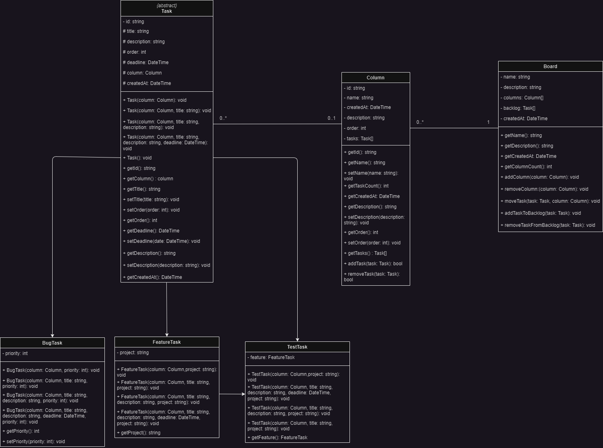

# Kancpp

Um programa que simula um quadro kanban. O quadro kanban funciona de forma simples: tarefas são representadas por cartões e movidas entre colunas que indicam o fluxo de trabalho, como "A fazer", "Em andamento" e "Concluído". Isso proporciona uma visualização clara do status das atividades, promovendo transparência, colaboração e identificação de gargalos. Ao limitar o trabalho em andamento, o Kanban evita sobrecargas e mantém um fluxo contínuo e equilibrado de trabalho. É uma abordagem flexível e adaptável, aplicável a diversos setores e projetos.

## Índice

* [Funcionalidades](#funcionalidades)
* [Estrutura do projeto](#estrutura-do-projeto)
* [Diagrama de classes](#diagrama-de-classes)
* [TADs e Algoritmos utilizados](#tads-e-algoritmos-utilizados)
  * [TADs](#tads)
  * [Algoritmos de ordenação](#algoritmos-de-ordenação)
  * [Algoritmos de busca](#algoritmos-de-busca)
* [Compilação e execução](#compilação-e-execução)
* [Autores](#autores)

## Funcionalidades

**Visão geral:** É possível visualizar o Kanban com suas colunas e as respectivas disposições de tarefas nas colunas;

**Adicionar colunas:** Os usuários podem adicionar novas colunas ao Kanban;

**Ordernar colunas:** Os usuários podem ordenar as colunas no Kanban da forma que desejar;

**Remover colunas:** Os usuarios podem remover colunas do Kanban:

**Adicionar tarefas:** Os usuários podem adicionar novas tarefas as colunas presente no Kanban, as tarefas são divididas em três tipos:
 **feature:** tarefa relacionada a novas funcionalidades, ou novidades no projeto;
 **test:** tarefa associada a uma feature, que descreve a implementação de tests na feature;
 **bug:** tarefa que descreve um comportamento inesperado no projeto em questão;

**Movimentação de tarefas:** Os usuários podem mover as tarefas entre as colunas do Kanban;

**Ordenação de tarefas:** O Kanban oferece a opção de ordenar as tarefas de forma crescente, decrescente ou com base em algum parâmetro específico, por exemplo: título ou prioridade;

**Editar tarefa:** Os usuários podem editar as tarefas existente no Kanban, alterando informações como título, descrição, prioridade ou prazo de termino;

**Excluir tarefa:** Os usuários podem remover uma tarefa do Kanban, removendo ela da coluna presente;

**Armazenamento em arquivo binário:** O Kanban pode ser armazenado em um arquivo binário, permitindo salvar as informações do quadro;

**Carregamento de arquivo binário:** Os usuários podem carregar as informações previamente salvas do Kanban a partir de um arquivo binário;

## Estrutura do projeto

**/bin:** Arquivos executáveis do projeto;

**/build:** Arquivos gerados e os arquivos objetos (.o);

**/data:** arquivos de dados salvos em binário (.bin);

**/docs:** Documentação em HTML, Latex e RTF, gerada pelo Doxygen;

**/include:** Arquivos cabeçalhos de extensão (.hpp) e (.h);

**/src:** Código fonte do projeto de arquivos (.cpp);

**.gitignore:** Arquivo do Git para ignorar arquivos no controle de versão;

**Makefile:** Arquivo de comandos para compilação;

**README.md:** Arquivo de descrição do projeto no repositório.

## Diagrama de classes

<p align="center">
  
</p>

* **Board**
  * Responsável pelo gerenciamento das colunas e o backlog
  * O atributo `columns` é do tipo `DoublyLinkedList<Column>`
  * O atributo `backlog` é do tipo `xxxxxxxx`
  * Possui métodos construtores
  * Possui métodos getters
  * Possui métodos para gerenciar as colunas e exibir o quadro, além de outros métodos adicionais

<br/>

* **Column**
  * Responsável pelo gerenciamento e armazenamento das tarefas
  * O atributo `tasks` é do tipo `Set`
  * Possui os métodos construtores da classe
  * Possui os métodos getters
  * Possui os métodos para gerenciar as tasks e outros adicionais

<br/>

* **Task**
  * Classe abstrata que deriva os tipos de tasks possíveis no programa
  * Possui os métodos construtores classe
  * Possui os métodos setters e getters

<br/>

* **FeatureTask**
  * Classe derivada da classe `Task`, essa classe serve apenas para tasks para features
  * Tem como atributo `project`, do tipo `string`, para descrever de qual projeto é a feature
  * Possui seus próprios métodos construtores
<br/>

* **BugTest**
  * Classe derivada da classe `Task`, essa classe deve ser usada para tasks sobre bugs
  * Possui como atributo `priority`, do tipo `int`, que serve para informar a prioridade para resolução do bug.
  * Possui seus próprios métodos construtores

<br/>

* **TestTask**
  * Classe derivada da classe `Task`, recomendada para uso em tasks do tipo teste
  * Possui como atributo feature do tipo `FeatureTask`, para informar qual feature será testada
  * Possui seus próprios métodos construtores

## TADs e Algoritmos utilizados

Nesse tópico iremos discutir sobre os TADS e os algoritmos de busca e ordenação utilizados no projeto.

### TADs

Tipos abstratos de dados (TADs) são estruturas de dados que definem um conjunto de operações e um comportamento específico, independentemente da implementação subjacente. No contexto de programação, um TAD permite ao desenvolvedor trabalhar com dados de forma abstrata, ocultando os detalhes da implementação e fornecendo uma interface consistente. Nesse projeto utilizamos os seguintes TADS:

1. **Lista duplamente encadeada**, que é um TAD que organiza elementos em uma sequência linear, onde cada elemento possui uma referência tanto para o próximo quanto para o elemento anterior. Essa estrutura de dados permite inserção e remoção eficientes em qualquer posição, uma vez que não é necessário deslocar os elementos adjacentes. Além disso, a lista duplamente encadeada oferece maior flexibilidade do que uma lista simplesmente encadeada, pois é possível percorrer a lista em ambas as direções. Isso torna as listas duplamente encadeadas adequadas para cenários onde é necessário acessar elementos em ambas as direções ou realizar operações de inserção/remoção frequentes em posições arbitrariamente escolhidas.

2. **Conjunto**, outro TAD que armazena uma coleção de elementos únicos, sem ordem específica. Diferente de uma lista, onde a ordem dos elementos importa, um conjunto prioriza a verificação de duplicatas e oferece operações eficientes para essa finalidade. A estrutura de dados de conjunto é particularmente útil quando é necessário verificar se um elemento pertence ao conjunto ou realizar operações de união, interseção ou diferença entre conjuntos. Com sua implementação adequada, um conjunto permite um acesso rápido e eficiente aos elementos, garantindo a integridade dos dados armazenados.

### Algoritmos de ordenação

Os algoritmos de ordenação usados no projeto foram os seguintes:

1. **Bubble sort**:  percorre repetidamente uma lista comparando elementos adjacentes e trocando-os se estiverem na ordem errada. Esse processo é repetido até que a lista esteja completamente ordenada. O Bubble Sort possui uma complexidade de tempo quadrática, O(n²), o que o torna ineficiente para grandes conjuntos de dados.

2. **Selection sort**: funciona selecionando repetidamente o menor elemento da lista não ordenada e colocando-o no início. Em cada iteração, o Selection Sort encontra o menor elemento e o troca com o elemento da posição atual. Esse processo é repetido até que a lista esteja completamente ordenada. O Selection Sort também possui uma complexidade de tempo quadrática, O(n²), tornando-o menos eficiente para grandes conjuntos de dados.

3. **Quick sort**: baseado na estratégia dividir e conquistar. Esse algoritmo seleciona um elemento pivô da lista e particiona os elementos restantes em dois subconjuntos, um com elementos menores que o pivô e outro com elementos maiores. Em seguida, o Quick Sort é aplicado recursivamente a cada um dos subconjuntos. O pivô é colocado em sua posição final após as partições e o processo é repetido até que a lista esteja completamente ordenada. O Quick Sort possui uma complexidade média de O(n*log n), tornando-o mais rápido do que o Bubble Sort e o Selection Sort em conjuntos de dados maiores. No entanto, em casos extremos, pode ter uma complexidade de tempo quadrática.

### Algoritmos de busca

Para esse projeto utilizamos duas estratégias para realizar buscas, sendo elas:

1. **Busca iterativa (sequencial)**: Funciona percorrendo cada elemento da lista sequencialmente até encontrar o elemento desejado ou chegar ao final da lista. A busca iterativa é fácil de implementar, mas sua complexidade de tempo é linear, O(n), pois pode ser necessário percorrer todos os elementos da lista para encontrar o elemento desejado. Portanto, a busca iterativa pode ser menos eficiente em conjuntos de dados grandes, em comparação com a busca binária. No entanto, a busca iterativa é adequada para casos em que a lista não está necessariamente ordenada ou quando é necessário percorrer todos os elementos da lista.
2. **Busca binária**: funciona dividindo repetidamente a lista ao meio e comparando o elemento buscado com o elemento do meio. Se forem iguais, a busca é concluída. Caso contrário, a metade onde o elemento buscado pode estar é selecionada e o processo é repetido até encontrar o elemento desejado ou determinar que ele não está presente na lista. A busca binária reduz pela metade o espaço de busca a cada iteração, o que resulta em uma complexidade de tempo logarítmica, O(log n), tornando-a eficiente para conjuntos de dados grandes.

## Compilação e execução

Primeiramente, é preciso ter o compilador g++ na sua máquina. Logo após confirmar isso, siga os passos a seguir:

### Passo 1: Obtenha o código fonte do projeto

Você pode realizar a clonagem do repositório do projeto em seu ambiente local ou fazer o download dos arquivos fonte e salvá-los em um diretório de sua preferência.

### Passo 2: Terminal

Abra algum terminal disponível no seu sistema e navegue até o diretório do projeto. Um exemplo a seguir do comando utilizado para navegar entre diretório:

```
cd Desktop/kancpp
```

### Passo 3: Comandos do makefile

Nesse momento, vamos executar o comando para compilar o projeto e gerar o executável:
```
make all
```

Logo após, o comando para executar arquivo .exe do projeto:

```
make run
```

Por fim, o programa já deve estar sendo executado. Faça bom uso das funcionalidades.

## Autores

* [**Pedro Paulo**](https://github.com/pedropauloo)
* [**Paulo Daniel**](https://github.com/paulo0301)
